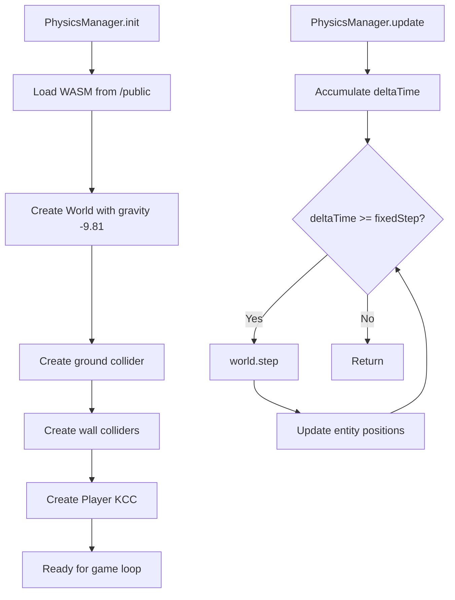
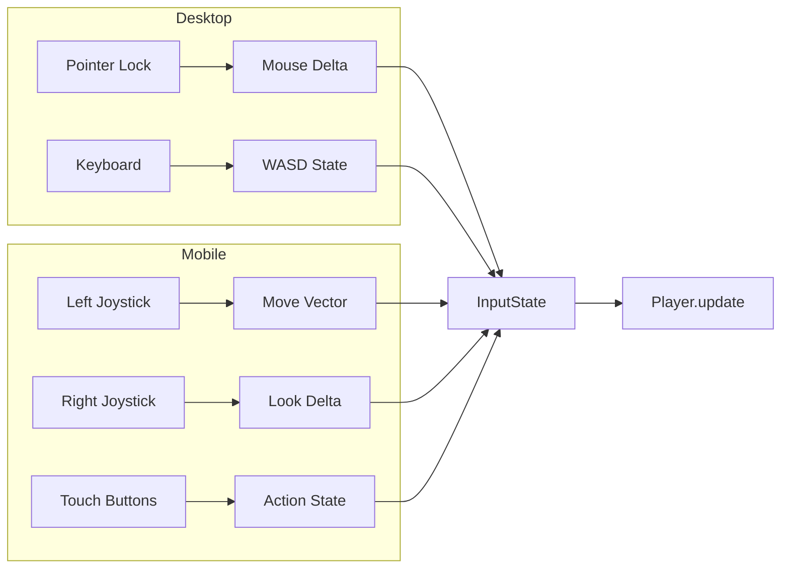
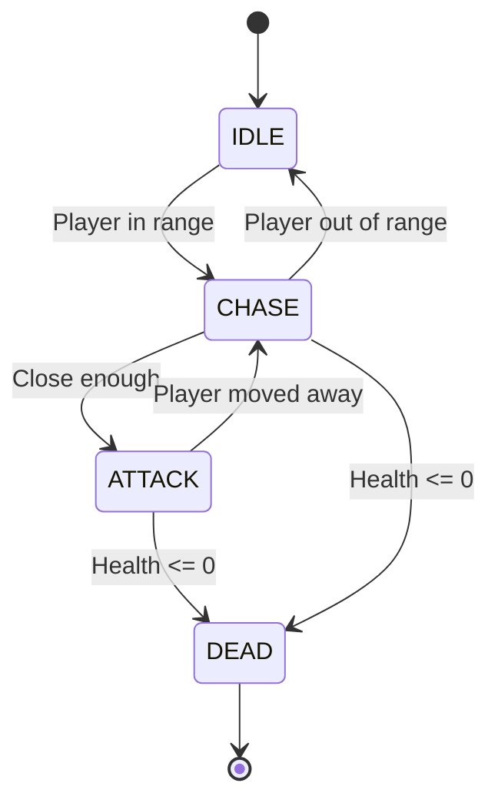
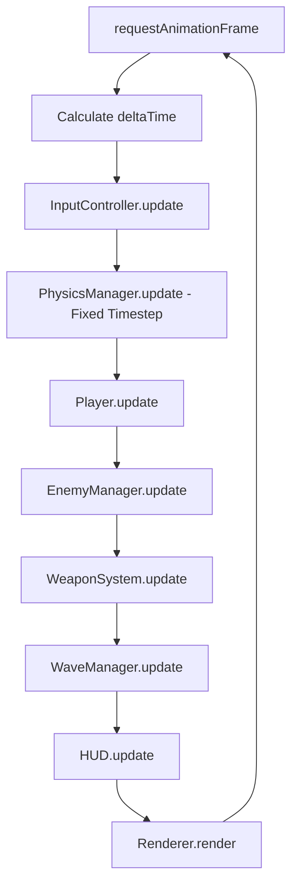
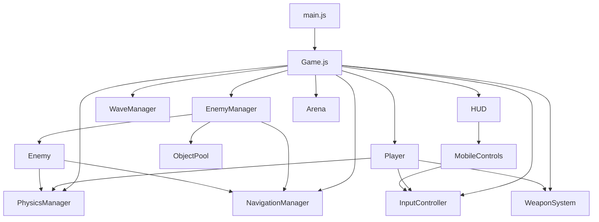

# Vanguard Web - 3D FPS Architecture Plan

## Executive Summary

**Project:** Vanguard Web - Mobile-optimized Single-player 3D FPS  
**Target Platforms:** Android Chrome, Windows Desktop  
**Deployment:** 100% Static GitHub Pages (No Backend)  
**Repository:** mackcheeses/Games

---

## 1. Technical Stack

| Component | Technology | Version | Purpose |
|-----------|------------|---------|---------|
| Renderer | Three.js | ^0.160.0 | WebGL 2.0 3D rendering |
| Physics | @dimforge/rapier3d-compat | ^0.12.0 | WASM physics with Kinematic Controller |
| AI Pathing | three-pathfinding | ^1.3.0 | NavMesh-based enemy navigation |
| Mobile Input | nipplejs | ^0.10.0 | Dual virtual joysticks |
| Build Tool | Vite | ^5.0.0 | Fast dev server + optimized builds |
| Deployment | GitHub Pages | - | Static hosting via gh-pages branch |

---

## 2. Project Structure

```
vanguard-web/
├── public/
│   └── rapier3d_bg.wasm          # Rapier WASM binary (copied at build)
├── src/
│   ├── main.js                   # Entry point, game loop
│   ├── Game.js                   # Main game orchestrator
│   ├── core/
│   │   ├── PhysicsManager.js     # Rapier initialization & world
│   │   ├── InputController.js    # Desktop + Mobile input handling
│   │   └── AudioManager.js       # Sound effects with gesture unlock
│   ├── systems/
│   │   ├── NavigationManager.js  # NavMesh creation & pathfinding
│   │   ├── WeaponSystem.js       # Raycast shooting, ammo, reload
│   │   ├── EnemyManager.js       # Enemy spawning, AI, pooling
│   │   └── WaveManager.js        # Wave progression logic
│   ├── entities/
│   │   ├── Player.js             # Player state, health, movement
│   │   ├── Enemy.js              # Enemy class with behavior
│   │   └── Projectile.js         # Optional: For future expansion
│   ├── world/
│   │   ├── Arena.js              # Level geometry creation
│   │   └── Lighting.js           # Scene lighting setup
│   ├── ui/
│   │   ├── HUD.js                # Health, ammo, wave display
│   │   ├── MobileControls.js     # NippleJS joystick setup
│   │   ├── SettingsMenu.js       # Sensitivity, button layout
│   │   └── GameOverScreen.js     # End game UI
│   └── utils/
│       ├── ObjectPool.js         # Generic object pooling
│       ├── MathUtils.js          # Vector helpers
│       └── StorageManager.js     # localStorage wrapper
├── index.html
├── style.css
├── vite.config.js
├── package.json
└── README.md
```

---

## 3. Module Architecture

### 3.1 PhysicsManager.js

**Responsibilities:**
- Initialize Rapier WASM from `/public`
- Create physics world with gravity
- Manage Kinematic Character Controller for player
- Handle collider creation for arena and enemies
- Fixed timestep updates (60Hz)



**Key Implementation Details:**
```javascript
// Rapier WASM loading pattern
import RAPIER from '@dimforge/rapier3d-compat';

class PhysicsManager {
  static FIXED_TIMESTEP = 1 / 60;
  
  async init() {
    await RAPIER.init(); // Loads WASM
    this.world = new RAPIER.World({ x: 0, y: -9.81, z: 0 });
    this.characterController = this.world.createCharacterController(0.01);
    this.characterController.enableAutostep(0.5, 0.2, true);
    this.characterController.enableSnapToGround(0.5);
  }
}
```

### 3.2 InputController.js

**Responsibilities:**
- Desktop: Pointer Lock API for mouse look, WASD movement
- Mobile: NippleJS dual joysticks (left=move, right=look)
- Unified input state object consumed by Player
- Sensitivity settings from localStorage



**Input State Interface:**
```javascript
const inputState = {
  movement: { x: 0, z: 0 },    // -1 to 1 for each axis
  look: { x: 0, y: 0 },        // Delta since last frame
  actions: {
    fire: false,
    reload: false,
    jump: false,
    crouch: false,
    ads: false
  }
};
```

### 3.3 NavigationManager.js

**Responsibilities:**
- Create NavMesh from floor geometry programmatically
- Provide pathfinding queries for enemies
- Debug visualization (optional)

**Critical Constraint:** `three-pathfinding` cannot auto-generate NavMesh from arbitrary geometry. We must:
1. Define floor zones manually as simple polygons
2. Build NavMesh from those zones

```javascript
import { Pathfinding, PathfindingHelper } from 'three-pathfinding';

class NavigationManager {
  init(floorGeometry) {
    this.pathfinding = new Pathfinding();
    // Create zone from floor mesh
    const zone = Pathfinding.createZone(floorGeometry);
    this.pathfinding.setZoneData('arena', zone);
  }
  
  findPath(start, end) {
    const groupID = this.pathfinding.getGroup('arena', start);
    return this.pathfinding.findPath(start, end, 'arena', groupID);
  }
}
```

### 3.4 WeaponSystem.js

**Responsibilities:**
- Raycast-based hit detection
- Ammo management (magazine + reserve)
- Reload timing
- ADS (Aim Down Sights) FOV shift
- Muzzle flash effects

**MVP Weapon Stats:**
```javascript
const ASSAULT_RIFLE = {
  name: 'AR-15',
  damage: 25,
  fireRate: 600,           // RPM
  magazineSize: 30,
  reserveAmmo: 90,
  reloadTime: 2.0,         // seconds
  range: 100,
  adsFOV: 45,              // degrees (normal is 75)
  adsSpeed: 0.15           // seconds to transition
};
```

### 3.5 EnemyManager.js & WaveManager.js

**EnemyManager Responsibilities:**
- Object pooling for enemies (avoid GC spikes)
- Enemy spawning at designated points
- Enemy AI state machine: IDLE -> CHASE -> ATTACK
- NavMesh path following

**WaveManager Responsibilities:**
- Wave progression logic
- Difficulty scaling (enemy count, speed, health)
- Spawn timing between waves



**Wave Scaling (5 waves for MVP):**
| Wave | Enemy Count | Health Multiplier | Speed Multiplier |
|------|-------------|-------------------|------------------|
| 1    | 3           | 1.0x              | 1.0x             |
| 2    | 5           | 1.0x              | 1.1x             |
| 3    | 7           | 1.2x              | 1.1x             |
| 4    | 10          | 1.3x              | 1.2x             |
| 5    | 15          | 1.5x              | 1.3x             |

---

## 4. Game Loop Architecture



**Fixed Timestep Implementation:**
```javascript
class Game {
  constructor() {
    this.accumulator = 0;
    this.fixedDelta = 1 / 60;
  }
  
  update(deltaTime) {
    this.accumulator += deltaTime;
    
    while (this.accumulator >= this.fixedDelta) {
      this.physics.step(this.fixedDelta);
      this.accumulator -= this.fixedDelta;
    }
    
    // Render with interpolation
    const alpha = this.accumulator / this.fixedDelta;
    this.render(alpha);
  }
}
```

---

## 5. Mobile Optimization

### 5.1 Landscape Lock
```javascript
// In main.js or Game.js init
if (screen.orientation && screen.orientation.lock) {
  screen.orientation.lock('landscape').catch(() => {
    // Fallback: Show "rotate device" message
  });
}
```

### 5.2 Touch Control Layout
```
+--------------------------------------------------+
|  [HP: 100]                         [Wave 1/5]    |
|                                                   |
|                                                   |
|     [JOYSTICK]              [CROSSHAIR]          |
|        LEFT                                       |
|                                    [JOYSTICK]    |
|                                      RIGHT       |
|                                                   |
| [RELOAD]  [CROUCH]           [FIRE]  [ADS]       |
+--------------------------------------------------+
```

### 5.3 Performance Budget
- **Target:** 60 FPS on mid-tier Android (Snapdragon 600 series)
- **Triangle Budget:** ~50,000 per frame
- **Draw Calls:** < 50
- **Shadows:** Single directional light, 512x512 shadow map
- **No post-processing** for MVP

---

## 6. Vite Configuration for WASM + GitHub Pages

```javascript
// vite.config.js
import { defineConfig } from 'vite';
import { viteStaticCopy } from 'vite-plugin-static-copy';

export default defineConfig({
  base: '/Games/',  // GitHub Pages repo path
  build: {
    target: 'esnext',
    outDir: 'dist',
    assetsInlineLimit: 0, // Don't inline WASM
  },
  plugins: [
    viteStaticCopy({
      targets: [
        {
          src: 'node_modules/@dimforge/rapier3d-compat/rapier_wasm3d_bg.wasm',
          dest: ''
        }
      ]
    })
  ],
  optimizeDeps: {
    exclude: ['@dimforge/rapier3d-compat']
  }
});
```

**package.json scripts:**
```json
{
  "scripts": {
    "dev": "vite",
    "build": "vite build",
    "preview": "vite preview",
    "deploy": "vite build && gh-pages -d dist"
  }
}
```

---

## 7. Phased Implementation Roadmap

### Phase 1: Foundation (Core Infrastructure)
1. Scaffold Vite project with correct structure
2. Configure Vite for WASM loading
3. Implement PhysicsManager with Rapier init
4. Create simple box arena with floor + walls
5. Verify physics works in browser (drop a cube)

**Deliverable:** Runnable build with physics working

### Phase 2: Player Controller
1. Implement Player class with Kinematic Controller
2. Add first-person camera attached to player
3. Implement desktop controls (WASD + mouse look)
4. Add jump and crouch mechanics
5. Verify no wall clipping

**Deliverable:** Playable first-person movement

### Phase 3: Mobile Controls
1. Integrate NippleJS for dual joysticks
2. Add touch buttons for actions
3. Implement landscape lock
4. Test on Android Chrome
5. Add sensitivity settings with localStorage

**Deliverable:** Fully playable on mobile

### Phase 4: Weapon System
1. Implement raycast shooting
2. Add crosshair UI
3. Implement ammo and reload
4. Add ADS with FOV transition
5. Basic muzzle flash effect

**Deliverable:** Functional shooting mechanics

### Phase 5: Enemy AI
1. Create NavigationManager with manual NavMesh
2. Implement Enemy class with state machine
3. Add EnemyManager with object pooling
4. Enemies chase and attack player
5. Enemy takes damage and dies

**Deliverable:** Enemies that navigate and attack

### Phase 6: Wave System & Polish
1. Implement WaveManager with 5 waves
2. Add HUD (health, ammo, wave counter)
3. Game over screen
4. Basic audio (optional stretch goal)
5. Final GitHub Pages deployment

**Deliverable:** Complete MVP ready for play

---

## 8. Critical Risk Mitigations

| Risk | Mitigation |
|------|------------|
| WASM fails to load on GitHub Pages | Use vite-plugin-static-copy, verify MIME types |
| NavMesh fails for complex geometry | Use simplified floor polygon, not auto-generate |
| Physics tunneling on mobile | Fixed 60Hz timestep, thicker colliders |
| Touch controls unresponsive | Prevent default on touch events, optimize joystick zones |
| Performance drops below 60 FPS | Frustum culling, object pooling, reduce shadow quality |
| Audio blocked on mobile | Require user gesture before AudioContext.resume() |

---

## 9. File Dependencies Graph



---

## 10. MVP Scope Definition

### Included in MVP:
- Single arena level (procedural boxes)
- One weapon (assault rifle)
- One enemy type (melee attacker)
- 5 waves with scaling difficulty
- Desktop + Mobile controls
- Basic HUD
- Settings persistence (localStorage)
- GitHub Pages deployment

### Deferred to Post-MVP:
- Multiple weapons
- Ranged enemy types
- Multiple arenas/levels
- Power-ups and pickups
- Leaderboards
- Sound effects
- Particle effects beyond muzzle flash

---

## 11. Testing Checklist

Before each phase completion:
- [ ] Runs locally via `npm run dev`
- [ ] No console errors
- [ ] Builds successfully via `npm run build`
- [ ] Preview works via `npm run preview`
- [ ] Physics stable at 60 FPS
- [ ] No memory leaks (check DevTools)
- [ ] Works on Chrome Desktop
- [ ] Works on Chrome Android (after Phase 3)

---

## Approval Request

This plan provides a comprehensive architecture for building Vanguard Web as a production-ready 3D FPS game. The phased approach ensures each milestone produces a runnable build.

**Next Steps:**
1. Review and approve this architecture
2. Switch to Code mode to begin Phase 1 implementation
3. Each phase will be committed and tested before proceeding

Ready to proceed with implementation?
